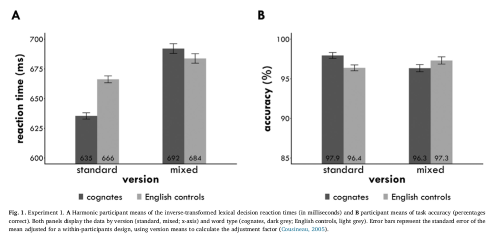
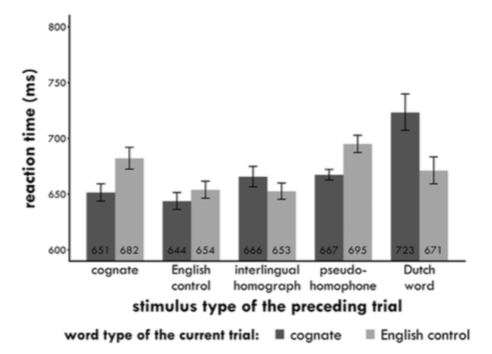

# Goal of the Study

- To determine whether the cognate facilitation effect is indeed influenced by stimulus list composition.

	
--

## Cognates 

- _“Words that exist in an identical (or near identical) form in more than one language and carry the same 			meaning, like “winter” in Dutch and English.”_ 

--

## Cognate facilitation effect 

- Cognates have an advantage over non-cognates. 
- This effect is robust and universal.

---

This study is a follow up of Poort et al. (2016)
- The cognate facilitation effect varied based on the types of words included in the stimulus list.

--

# Research questions 

1. Does stimulus list composition affect the cognate facilitation effect? (Experiment 1) 

2. What types of stimuli can significantly influence the direction and/or magnitude of the cognates facilitation 	effect? (Experiment 2)

---

# Methodology 

--

## Experiment 1:

- Dutch-English bilinguals performed a lexical decision task 

- Two versions: 
  1. Standard (included _identical cognates, English controls, and regular non-words_) 

  2. Mixed (included _identical cognates, English controls, identical interlingual homographs, English 		          sounding pseudohomophones, and Dutch-only words_). 

---

# Results of Experiment 1:

- In the standard version they found a significant cognate facilitation effect of 31 ms. 
- In the mixed version, cognates were recognized 8 ms more slowly than English controls. 
- Although the second difference was not significant, there was a change in the direction of the effect. 

---

# Experiment 2: 

- Evaluated the influence of the filler types of Experiment 1. 

- Dutch-English bilinguals performed a similar lexical decision task. 

- Five versions: standard, mixed, Dutch words, interlingual homographs, pseudohomophones. 

- Participants were instructed to respond “No” to any word that was not in English.
---

# Results of Experiment 2:

- The standard and mixed versions replicated the results of Experiment 1. 

- Comparison of filler types: the presence or absence of the Dutch words seemed to be a critical influence on 	    the cognate effect. 

- In a trial by trial basis, cognates preceded by a Dutch word were recognized more slowly. 

---

# Conclusions

- The cognate facilitation effect is influenced by stimulus list composition. 

- Different stimulus types affect the cognate effect in different ways. 

- The presence of words in the non-target language affects the cognate effect significantly. 

---

# What is available online

- Experiment 2 only. 

- Experiment programs and materials 

- Stimuli 

- Raw data 

- Processing scripts 

- Processed data 

- Analysis scripts 

[Experiment 2 Files](https://osf.io/zadys/)

---

# Are there instructions for reproducing the results?

- There are instructions on the website and also in the code. 

[Instructions](https://osf.io/zadys/wiki/home/)

Can you run the code without errors? 

Are you able to reproduce the plots and tables?

---

# Evaluation

- 9/10 

- It has a lot of files available online.  

- It has specific instructions. 

- There is no README file. 

- The code is extensively commented. 

- **BUT** instructions and comments are complex for novice R users. 

---
class: center, middle

---

